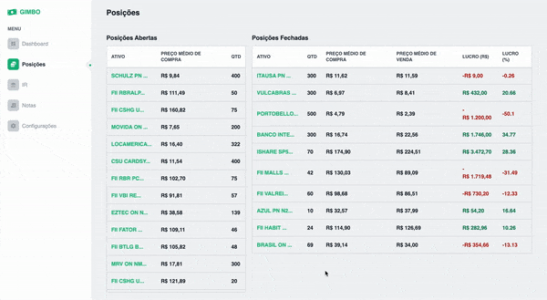

# Gimbo

Aplicação web para visualização de notas de corretagem em formato PDF

## TODO

- [x] Tabelas de posições abertas e fechadas
- [x] Integração com AlphaVantage
- [x] Gráfico Candlestick dos últimos 100 dias
- [x] Input manual de notas personalizadas
- [ ] Salvar as informações mais recentes da API
- [ ] Montar Dashboard
- [ ] Discriminação de valores na tabela de IR (valor atribuído a quais ativos)
- [ ] Adicionar função para o caso de desdobramento de ações
- [ ] Cálculo do lucro/prejuízo baseado no preço de fechamento da API
- [ ] Integração com Firebase

## Setup

1. Criar pasta _notas_ e armazenar os arquivos PDFs a serem lidos
2. Adicionar variável [_ALPHAVANTAGE_KEY_](https://www.alphavantage.co/) no arquivo _.env_
3. Rodar: _npm build_
4. Rodar: _npm start_
